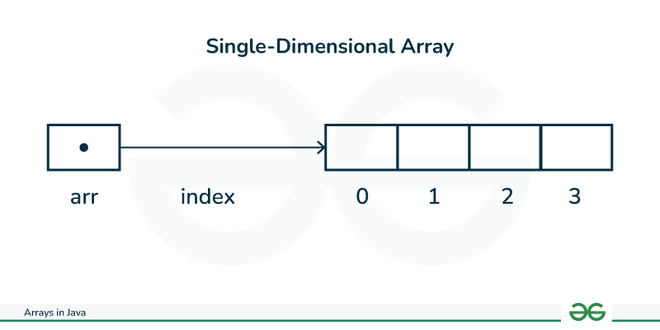
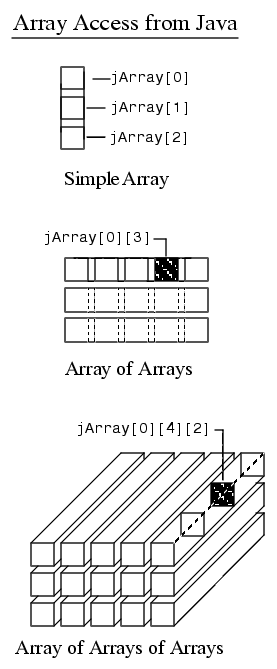

# Introdução ao Java

---

Neste capítulo são abordados conceitos introdutórios do java, como o primeiro hello world, como são feitos os comentários, estruturas lógicas, condicionais e de repetição.

## Hello World (Aula 1)

---

Primeiramente, para que o código seja executado o java precisa identificar qual o pacote do códio e inicializar a classe main. 

Feito isto, esse é um exemplo de Hello World exibido no terminal em Java:


```java
package academy.devdojo_maratonajava.introdução;

public class A01_HelloWorld {
    public static void main(String[] args) {
        System.out.println("olá.");
    }
}
```

## Comentários (Aula 1)

---

Os comentários são trechos do arquivo que são ignorados pelos compiladores. No java os comentários podem ser feitos de duas formas:

De linha única, usando //: 
```java
// Esse é um comentário de uma linha em Java
```

Comentário de múltiplas linhas, usando /*:
```java
/*
 Esse é um comentário
  de múltiplas linhas 
  em Java
 */
```
## Tipos primitivos (Aulas 2 e 3)

---

No java, existem 8 tipos primitivos, são eles:

| nome do tipo |             O que representa              |
|:------------:|:-----------------------------------------:|
|     int      |             Números inteiros              |
|    double    | valores com casas decimais mais precisas  |
|    float     | valores com casas decimais menos precisas |
|     long     |     valores grandes, com muitas casas     |
|   boolean    |   armazenamento de verdadeiro ou falso    |
|    short     |              valores menores              |
|     byte     |        armazena valores de 1 byte         |
|     char     |       armazena apenas um caractere        |


Para inicializar uma variável em java, devemos primeiramente declarar o tipo da variável, o nome dela, e atribuir um valor
O valor da variável pode ser exibido ou utilizado usando o nome da variável

A variável pode ser concatenada com texto ou outras variáveis, usando

```java
public static void main(String[] args) {
    int idade = 22;
    System.out.println("Eu tenho " + idade + " anos");
}
```

### Strings

As strings não são um tipo primitivo no Java, mas sim uma classe, que deve ser inicalizada da mesma forma que as outras variáveis, e também pode ser concatenada

```java
public static void main(String[] args) {
    String nome = "Isaac";
    System.out.println("Oi, meu nome é " + nome);
}
```


## Operadores (Aula 4)

--- 

Dentro do java temos diversos tipos de operadores, aritméticos, lógicos, de atribuição e relacionais

* ### Operadores aritiméticos

| operador |        função        |
|:--------:|:--------------------:|
|    +     |        adição        |
|    -     |      subtração       |
|    *     |    multiplicação     |
|    /     |       divisão        |
|    %     | resto de uma divisão |

> [!NOTE]  
> O operador de adição no java é sobrecarregado, e pode ser usado tanto para adição quanto para concatenação, por isso, em alguns casos pode ser ideal usar uma terceira variável para armazenar o resultado de uma operação

```java
public static void main(String[] args) {
    int n1 = 2;
    int n2 = 3;
    int soma = 2 + 3;
    System.out.println(soma);
}
```
* ### Operadores relacionais

| operador |     função     |
|:--------:|:--------------:|
|    <     |   menor que    |
|    \>    |   maior que    |
|   \>=    | maior ou igual |
|    <=    | menor ou igual |
|    !=    |  diferente de  |
|    ==    |    igual a     |

> Os operadores relacionais sempre retornam valores booleanos (_true_ ou _false_)

```java
public static void main(String[] args) {
    boolean isDezMaiorQueVinte = 10 > 20;
    boolean isDezMenorQueVinte = 10 < 20;
    boolean isDezIgualVinte = 10 == 20;
    System.out.println("isDezMaiorQueVinte " +isDezMaiorQueVinte);
    System.out.println("isDezMenorQueVinte " + isDezMenorQueVinte);
    System.out.println("isDezIgualVinte " + isDezIgualVinte);
}
```

* ### Operadores lógicos

Há apenas dois operadores lógicos, o AND (&&) e o OR (||). Usamos and quando queremos que mais de uma condição seja verificada, e or quando apenas uma de várias condições precisa ser verdadeira.

Exemplo de código usando o AND
```java
public static void main(String[] args) {
    int idade = 21;
    float salario = 3500;

    boolean isDentroDaLeiMaiorQueTrinta = idade > 30 && salario >= 4612;
    boolean isDentroDaLeiMenorQueTrinta = idade < 30 && salario >= 3381;
    System.out.println("isDentroDaLeiMaiorQueTrinta "+ isDentroDaLeiMaiorQueTrinta);
    System.out.println("isDentroDaLeiMenorQueTrinta "+ isDentroDaLeiMenorQueTrinta);
}
```
Exemplo de código usando o OR
```java
public static void main(String[] args) {
    double valorTotalContaCorrente = 200;
    double valorTotalContaPoupança = 10000;
    float valorPlaystation = 5000f;
    boolean isPs5Compravel = valorTotalContaCorrente > valorPlaystation || valorTotalContaPoupança > valorPlaystation;
    System.out.println("isPs5Compravel " +isPs5Compravel);
}
```
* ### Operador de atribuição

O operador de atribuição em java é o =

> [!NOTE]  
> Usando apenas um sinal de = é feita a atribuição de um valor à variável e com dois sinais (==) é feita a comparação entre valores.

## Estruturas condicionais (Aula 5)

---

As estruturas condicionais permitem que o programa tome decisões com base em condições específicas.
Isso é fundamental para a criação de lógica de controle dentro dos programas, permitindo que diferentes blocos de código 
sejam executados dependendo dos valores das variáveis ou de expressões avaliadas como verdadeiras ou falsas.

### Condicional if

```java
public static void main(String[] args) {
int idade = 20;
        if (idade >= 18) {
            System.out.println("Você é maior de idade.");
        }
}
```

### Condicional else

O else serve para executar um bloco de código caso a condição dentro do if não seja satisfeita. 
Podem também ser utilizados mais de um else, para verificar várias condições, como no exemplo a seguir:

```java
public class A05_EstruturasCondicionais02 {
    public static void main(String[] args) {
        int age = 21;
        if (age < 15){
            System.out.println("Categoria Infantil");
        } else if (age >= 15 && age < 18) {
            System.out.println("Categoria Juvenil");
        }else {
            System.out.println("Categoria adulto");
        }
    }
}
```

### Operadores ternários

Um operador ternário verifica uma condição e gera duas 'respostas' para caso a condição retorne true ou false.

```java

    public static void main(String[] args) {
        double salario = 3300;
        String frase1 = "Mais de 5000";
        String frase2 = "Menos de 5000";
        String resultado = salario > 5000 ? frase1 : frase2;
        System.out.println(resultado);
    }
```

No código acima, é verificado se a variavel salario é mais de 5000 e caso essa condição retorne true, é atribuído o valor
da frase 1 à String resultado, caso retorne false, é atribuído o valor da frase 2.

### Switch case

O switch case verifica diversos casos, caso o valor da variável seja igual á um dos casos, é executado o bloco de código.
Dentro do bloco, usamos o `break;` para interromper a execução do switch.

Podemos também atribuir o mesmo bloco de código para mais de um case

```java
public static void main(String[] args) {
    int dia =  2;
    switch (dia){
        default:
            System.out.println("Opção inválida");
            break;
        case 1:
        case 7:
            System.out.println("Fim de semana");
            break;
        case 2:
        case 3:
        case 4:
        case 5:
        case 6:
            System.out.println("Dia útil");
            break;
    }
}

```

Usamos o case default como uma opção padrão que será executada caso a variável não seja compatível com nenhum dos casos do switch

## Estruturas de repetição

--- 

Uma estrutura de repetição executa um bloco de código até que uma condição seja satisfeita, e o java possui algumas dessas, que viremos nesta seção:


### While

O while executa um bloco de código _enquanto_ uma condição é _true_, sendo interrompida quando a condição se torna _false_, como no exemplo a seguir:

```java

public static void main(String[] args) {
    int i = 0;
    while (i < 10){
        System.out.println(i++);
    }
}

```

Há também o loop `do-while`, que se diferencia pois executa o bloco de código ainda que a condição seja false

```java

public static void main(String[] args) {
    int i = 12;
    do {
        System.out.println(i);
    }while (i < 10);
}

```

### For

O for funciona de maneira semelhante, porém incorpora 3 expressões dentro dos parâmetros, que definem respectivamente 
a variável utilizada, a condição do loop, e o incremento ou decremento da variável auxiliar


```java

public static void main(String[] args) {
    for (int i = 0; i < 10; i++) {
        System.out.println(i);
    }
}

```

Podemos interromper a execução de um laço de repetição ainda que a condição seja true, utilizando o `break`

```java

public static void main(String[] args) {
    for (int i = 0; i < 10; i++) {
        if (i >8){
            break;
        }
        System.out.println(i);
    }
}

```


## Arrays

---

Um array é uma forma de armazenar diversos valores em uma mesma variável de referência, como em uma lista,
onde cada valor está armazenado em um índice


<div align="center"> 



</div>

O primeiro índice de um array é sempre zero.

Para inicializar um array no java, usamos os seguintes comandos:

```java

public static void main(String[] args) {
    int[] numeros = new int[3];
}

```

Devemos passar dentro dos colchetes o número máximo de índices do array, no array acima, temos três posições declaradas, 
mas como o 0 é o primeiro, o índice máximo é o dois

Arrays possuem valores padrão para os índices não inicializados 


|  tipo   | Valor padrão  |
|:-------:|:-------------:|
|   int   |       0       |
| double  |       0       |
|  float  |       0       |
|  long   |       0       |
|  short  |       0       |
|  byte   |       0       |
| boolean |     false     |
|  char   | \\u0000 (' ') |
| String  |     null      |


Podemos atribuir e imprimir valores de índices específicos


```java

public static void main(String[] args) {
    int[] numeros = new int[3];
    
    numeros[0] = 1;
    numeros[1] = 4;
    numeros[2] = 3;

    System.out.println(numeros[2]);
}
```

Uma boa forma de imprimir todos os valores de um array, é usar um loop for limitado pelo tamanho array

```java

public static void main(String[] args) {
    int[] numeros = new int[3];
    
    numeros[0] = 1;
    numeros[1] = 4;
    numeros[2] = 3;

    for (int i = 0; i < numeros.length; i++) {
        System.out.println(numeros[i]);
    }
}

```

É possível também inicializar um array diretamente com os valores

```java
public static void main(String[] args) {
    int[] numeros = {1,4,3};

    for (int i = 0; i < numeros.length; i++) {
        System.out.println(numeros[i]);
    }
}
```

Podemos também percorrer um array usando um enhanced for

```java
public static void main(String[] args) {
    int[] numeros = {1,4,3};

    for (int numero : numeros) {
        System.out.println(numero);
    }
}
```
Neste caso, é gerada uma variável de referência que itera sob todas as posições do array


É importante salientar que não é possível aumentar o tamanho de uma array durante a execução do código,
e se tentarmos fazer isso em tempo de execução, na verdade, a variável de referência será atribuída a um novo espaço em memória 
e o array antigo se tornará inacessível

### Arrays Multidimensionais

Um array multidimensional é um array que tem outros arrays em seus índices. Por exemplo, um array com uma dimensão é como uma linha 
com um índice para cada valor, já um array de duas dimensões teria linhas e colunas.

A ilustração abaixo pode facilitar o entendimento:

<div align="center"> 



</div>

Para percorrer por todas as posições de um array multidimensionais, usamos os mesmo métodos anteriores, mas utilizando 
mais de um loop


Usando for regular:
```java
    public static void main(String[] args) {
        
        int [] [] dias = new int [3] [3];
        dias [0] [0] = 31;
        dias [0] [1] = 28;
        dias [0] [2] = 31;

        dias [1] [0] = 31;
        dias [1] [1] = 28;
        dias [1] [2]= 31;

        for (int i = 0; i < dias.length; i++) {
            for (int j=0; j<dias[0].length; j++){
                System.out.println(dias[i][j]);
            }
        }
    }
```

Usando enhanced for
```java
    public static void main(String[] args) {
        
        int [] [] dias = new int [3] [3];
        dias [0] [0] = 31;
        dias [0] [1] = 28;
        dias [0] [2] = 31;

        dias [1] [0] = 31;
        dias [1] [1] = 28;
        dias [1] [2]= 31;

        for(int[] arrBase: dias){
            for(int num: arrBase){
                System.out.println(num);
            }
        }
    }

```

No caso do enhanced for, como precisamos que a variável seja do mesmo tipo que a armazenada no array, 
e um array multidimensional armazena arrays, utilizamos um array de inteiros para percorrer os índices do primeiro array


