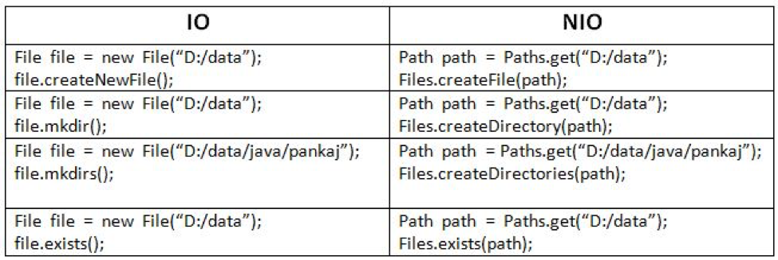

# Java NIO (New IO)

---
## Paths

A classe Paths foi criada para substituir e dar suporte para a classe File e as funcionalidades da classe File, e os métodos
da classe File são usados pela classe Files



O método get da classe Path é sobrecarregado, logo, a string usada para localizar o arquivo pode ser usada de várias formas,
como no exemplo a seguir:

```java
public class PathTest01 {
    public static void main(String[] args) {
        Path p1 = Paths.get("C:\\Users\\ispit\\Documents\\Foco total\\ddj1\\src\\academy\\devdojo_maratonajava\\javacore\\Wnio\\README.md");
        Path p2 = Paths.get("C:\\Users\\ispit\\Documents\\Foco total\\ddj1\\src\\academy\\devdojo_maratonajava\\javacore\\Wnio", "README.md");
        Path p3 = Paths.get("C:", "Users\\ispit\\Documents\\Foco total\\ddj1\\src\\academy\\devdojo_maratonajava\\javacore\\Wnio\\README.md");
        Path p4 = Paths.get("C:","Users", "ispit", "Documents", "Foco total","ddj1", "src", "academy", "devdojo_maratonajava", "javacore", "Wnio", "README.md");
    }
}
```

Para criar uma pasta usando o Path, podemos usar dois métodos, o CreateDirectory e o CreateDirectories

```java
public class PathTest02 {
    public static void main(String[] args) throws IOException {
        Path pastaPath = Paths.get("pasta");
        Path pastaDirectory = Files.createDirectory(pastaPath);
    }
}
```

O método CreateDirectory lança uma exceção do tipo checked, e se for executado mais de uma vez, lança outra exceção, pois o diretório a ser criado já existe.

Para contornar esse problema, podemos adicionar uma validação para verificar a existência do diretório.

```java
public class PathTest02 {
    public static void main(String[] args) throws IOException {
        Path pastaPath = Paths.get("pasta");
        if (Files.notExists(pastaPath)){
            Path pastaDirectory = Files.createDirectory(pastaPath);
        }
    }
}
```

Caso tentemos criar um subdiretório sem antes criar o diretório pai, o método CreateDirectory lançará uma exceção, 
o que não ocorre usando o CreateDirectories, que cria os diretórios não existentes. Além disso, não é lançada uma exceção
caso o diretório já exista

```java
public class PathTest02 {
    public static void main(String[] args) throws IOException {
        Path pastaPath = Paths.get("pasta");
        if (Files.notExists(pastaPath)) {
            Path pastaDirectory = Files.createDirectories(pastaPath);
        }
        Path subPastaPath = Paths.get("pasta/subpasta/subsubpasta");
        Path subPastaDirectory = Files.createDirectories(subPastaPath);
    }
}
```

Para criar um arquivo, usamos `Files.createFile()`, que recebe um atributo do tipo Path. No entanto, assim como o createDirectory,
se for executado novamente, lançará uma exceção pois o arquivo já existe. O que pode também ser contornado com a verificação da existência do arquivo


```java
public class PathTest02 {
    public static void main(String[] args) throws IOException {
        Path pastaPath = Paths.get("pasta");
        if (Files.notExists(pastaPath)){
            Path pastaDirectory = Files.createDirectories(pastaPath);
        }

        Path subPastaPath = Paths.get("pasta/subpasta/subsubpasta");
        Path subPastaDirectory = Files.createDirectories(subPastaPath);

        Path filePath = Paths.get(subPastaPath.toString(), "file.txt");
        if (Files.notExists(filePath)){
            Path filePathCreate = Files.createFile(filePath);
        }

    }
}
```

### Copiando um arquivo

Para copiar um arquivo usamos o método Files.copy, passando a fonte do arquivo que será copiado e o destino do novo arquivo.
Semelhante ao CreateDirectory, se tentarmos criar um arquivo que já existe, teremos uma exceção. Para evitar isso, usamos o modificador
`StandardCopyOption.REPLACE_EXISTING`, que substitui o arquivo existente no caminho

```java
public class PathTest02 {
    public static void main(String[] args) throws IOException {
        Path pastaPath = Paths.get("pasta");
        if (Files.notExists(pastaPath)){
            Path pastaDirectory = Files.createDirectories(pastaPath);
        }

        Path subPastaPath = Paths.get("pasta/subpasta/subsubpasta");
        Path subPastaDirectory = Files.createDirectories(subPastaPath);

        Path filePath = Paths.get(subPastaPath.toString(), "file.txt");
        if (Files.notExists(filePath)){
            Path filePathCreate = Files.createFile(filePath);
        }

        Path source = filePath;
        Path target = Paths.get(filePath.getParent().toString(),"file_renamed.txt");
        Files.copy(filePath,target, StandardCopyOption.REPLACE_EXISTING);
    }
}
```

## Normalização